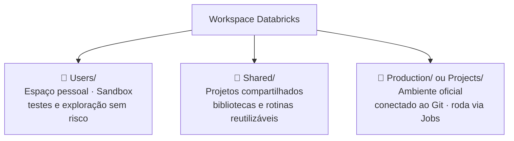
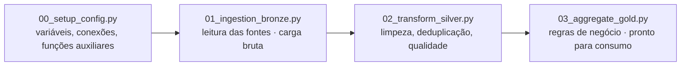
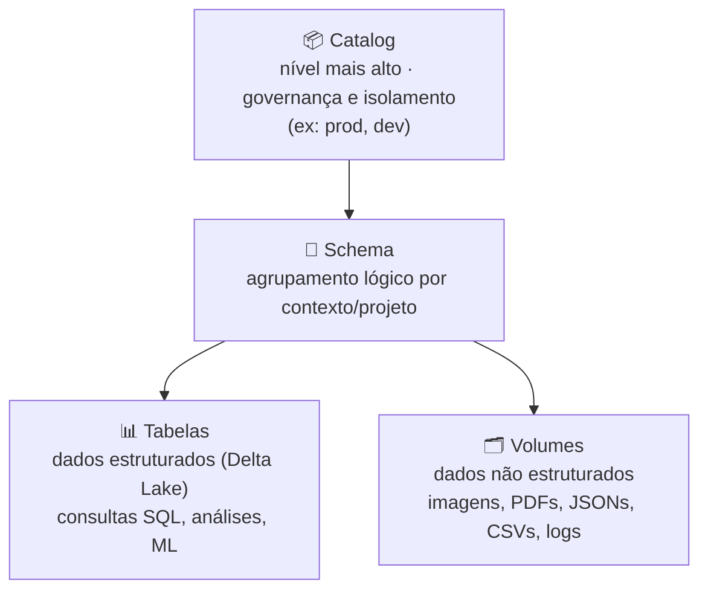

[← Voltar para Databricks com SQL, Python e PySpark](https://github.com/joycequoos/Databricks-com-linguagem-SQL-Python-PySpark-Para-An-lise-de-Dados-Cloud/blob/main/README.md)

# Databricks — Primeiros Comandos e Manipulação de Arquivos

Organização de notebooks e hierarquia de dados no Databricks: como estruturar o Workspace do jeito certo e como funciona o Unity Catalog (Catalog → Schema → Tabelas → Volumes).

## Sumário

- [Parte 1 — Organização de Notebooks](#parte-1--organização-de-notebooks)
  - [Onde cada tipo de código vive](#onde-cada-tipo-de-código-vive)
  - [Estrutura por Arquitetura Medalhão](#estrutura-por-arquitetura-medalhão)
  - [Boas práticas x Práticas inadequadas](#boas-práticas-x-práticas-inadequadas)
  - [Passo a passo: criando a estrutura de pastas](#passo-a-passo-criando-a-estrutura-de-pastas)
- [Parte 2 — Hierarquia do Unity Catalog](#parte-2--hierarquia-do-unity-catalog)
  - [A hierarquia em um diagrama](#a-hierarquia-em-um-diagrama)
  - [O que é cada nível](#o-que-é-cada-nível)
  - [Passo a passo: criando a hierarquia na prática](#passo-a-passo-criando-a-hierarquia-na-prática)
- [Resumo geral](#resumo-geral)

---

## Parte 1 — Organização de Notebooks

> **Resumo:** um notebook Databricks é um documento interativo onde se escreve, executa e compartilha código de análise de dados. Organizar bem esses notebooks deixa de ser preferência pessoal e vira requisito para engenharia de dados, qualidade e esteiras de CI/CD em ambiente corporativo.

### Onde cada tipo de código vive

O Workspace do Databricks se divide em três grandes áreas, cada uma com um propósito diferente:

### Estrutura por Arquitetura Medalhão

Em projetos de Engenharia de Dados, os notebooks costumam seguir as camadas da arquitetura Medalhão — cada script com uma responsabilidade só:

**Formas de modularizar o código:**

| Recurso | Para que serve |
|---|---|
| `%run ./notebook_auxiliar` | Executa um notebook dentro de outro, importando variáveis e funções |
| Arquivos `.py` nativos | Importados como módulos Python comuns (`import my_module`) |
| `dbutils.widgets` | Captura parâmetros de entrada dinamicamente (data, ambiente dev/prod) — evita valores fixos no código |
| `%md` | Documenta objetivo, entradas, saídas e regras de negócio direto nas células |

**Governança e versionamento:** o **Databricks Repos** sincroniza pastas de notebooks com repositórios remotos (GitHub, Azure DevOps, GitLab, Bitbucket), viabilizando versionamento por branch, code review e CI/CD.

### Boas práticas x Práticas inadequadas

| Aspecto | ❌ Prática inadequada | ✅ Boa prática |
|---|---|---|
| **Escopo do script** | Notebook monolítico com milhares de linhas fazendo ingestão e carga juntas | Notebooks pequenos, uma responsabilidade cada |
| **Versionamento** | Código alterado direto no workspace, sem histórico | Notebooks vinculados a repositório Git, com controle por branch |
| **Parametrização** | Variáveis trocadas manualmente a cada execução | Uso de Widgets + parâmetros de Databricks Jobs |
| **Reutilização** | Código duplicado em vários notebooks | Funções utilitárias em módulos/notebooks utilitários |

### Passo a passo: criando a estrutura de pastas

**1. Acessar o Databricks / Workspace**

**2. Dentro do Workspace, ir em Users e selecionar o usuário**

**3. Criar uma nova pasta**

**4. Criar a subpasta "Links importantes"**

**5. Criar a subpasta "Comandos Básicos"**

**6. Dentro de "Comandos Básicos", criar o primeiro notebook**

**7. Renomear o notebook para "testes"**

**8. Remover o notebook de testes**

---

## Parte 2 — Hierarquia do Unity Catalog

> **Resumo:** o Unity Catalog é a solução de governança unificada de dados e IA da Databricks — uma camada única de controle aplicada a todos os workspaces, em qualquer nuvem (AWS, Azure ou GCP).

### A hierarquia em um diagrama

### O que é cada nível

| Nível | Função principal | Tipo de dado contido |
|---|---|---|
| **Catalog** | Governança e isolamento de alto nível | Schemas |
| **Schema** | Agrupamento lógico por contexto/projeto | Tabelas, Views, Volumes |
| **Tabelas** | Dados estruturados para consulta SQL/Analytics | Linhas e colunas (Delta) |
| **Volumes** | Armazenamento governado de arquivos brutos | Arquivos não estruturados |

### Passo a passo: criando a hierarquia na prática

**1. Escolher a linguagem da célula e criar novas células de código**

**2. Criar um Catalog** (exemplo baseado na [documentação oficial da Microsoft](https://learn.microsoft.com/en-us/azure/databricks/catalogs/create-catalog))

Após executar o comando na célula, o Catalog é criado:

**3. Deletar um Catalog**

**4. Criar a hierarquia completa (Catalog → Schema → Tabela/Volume)**

**5. Criar o Schema**

> Dentro do Schema, é possível criar **Volumes** e **Tabelas**.

**6. Criar uma Tabela**

**7. Criar um Volume**

**8. Resultado final** — Tabela e Volume dentro do mesmo Schema:

---

[Criando ambiente Oficial do Curso](https://github.com/joycequoos/Databricks_Ambiente_Oficial_Curso)

**Próximos passos:** aprofundar em manipulação de dados com PySpark (filtros, colunas, tipos, agregações) dentro dessa estrutura já organizada.
